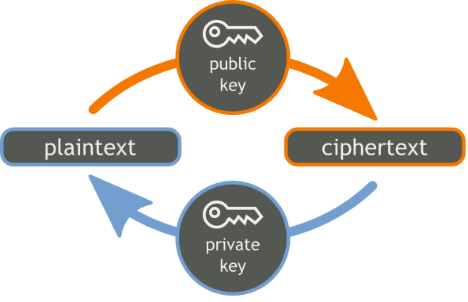

```{r setup, include=FALSE}
knitr::opts_chunk$set(comment = "", message = FALSE)
library(gpg)
gpg_restart(tempdir(), silent = TRUE)
gpg_list_keys <- function(...){
  gpg::gpg_list_keys(...)[c("id", "name", "email")]
}
gpg_verify <- function(...){
  gpg::gpg_verify(...)[c("fingerprint", "timestamp", "success")]
}
```

## Crypto in R

Three packages for public key cryptography in R:

- `openssl`: DSA, RSA, EC curves P-256, P-384 and P-521, SSL
- `sodium` : Curve-25519
- `gpg` : Wraps GPG system

Each package has:

- Public key **encryption** (encrypt/decrypt)
- Public key **signatures** (sign/verify)

Other stuff:

- Secure password storage, Crypto hashes, secure RNG, Diffie Hellman, 
SSL connections, etc


## Public key crypto

<style>
img{margin-left: 100px;}
</style>




- **ENCRYPTION**: Encrypt with pubkey, decrypt with private key
- **SIGNATURES**: Sign private key, verify with pubkey

## Example: GPG

Load the package

```{r}
library(gpg)
```

First keyring is empty:

```{r}
gpg_list_keys()
```

## Generate GPG keypair

```{r, message=FALSE}
mykey <- gpg_keygen(name = "Jerry", email = "jerry@gmail.com")
print(mykey)
gpg_list_keys()
```

## Export pubkey

```{r}
cat(gpg_export(id = mykey))
```

## Import someones public key

```{r}
gpg_recv(id ="A4A928C769CD6E44")
gpg_list_keys()
gpg_list_keys(secret = TRUE)
```


## Encrypt a message

```{r}
writeLines("This is secret information", con = "secret.msg")
encrypted <- gpg_encrypt("secret.msg", receiver = mykey)
cat(head(encrypted))
```

## Decrypt a message

GPG automatically finds the correct private key (if you have it).

```{r}
# we have the private key
writeLines(encrypted, "encrypted.msg")
gpg_decrypt("encrypted.msg")
```

For this demo we encrypted with out own key so we can decrypt.

## Sign a message

```{r}
cat(sig <- gpg_sign("secret.msg", id = mykey))
writeLines(sig, "secret.sig")
```


## Verify a signature

```{r}
gpg_verify("secret.msg", "secret.sig")
```

## Example: signed debian pgk

```{r}
# Key from Johannes Ranke
gpg_recv('6212B7B7931C4BB16280BA1306F90DE5381BA480')

# Verify the file
library(curl)
curl_download(
  'https://cran.r-project.org/bin/linux/debian/jessie-cran3/Release', 'Release')
curl_download(
  'https://cran.r-project.org/bin/linux/debian/jessie-cran3/Release.gpg', 'Release.gpg')
gpg_verify('Release', 'Release.gpg')
```

## Read me

On CRAN very soon :)

```{r, eval=FALSE}
devtools::install_github('jeroenooms/gpg')
```

Very comprehensive vignette!
